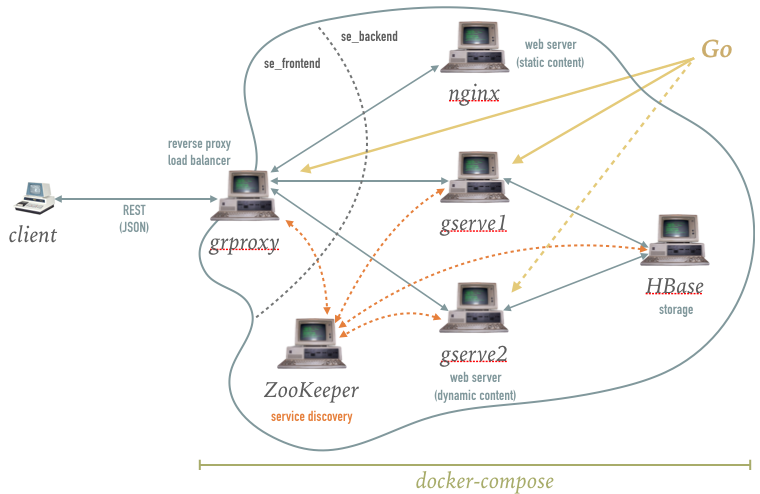

Systems Engineering 2 - Assignment 1
====================================

Organisation
------------

* **deadline:** January 11th 2017 11:59pm
* git usage is mandatory (multiple commits with meaningful messages)
* Go is mandatory
* you have to work alone
* don't share code
* ask questions in the `Auditorium <https://auditorium.inf.tu-dresden.de/en/groups/110631002>`_

Task description
----------------

You are required to develop an online **document library**.
Users are presented with an input form, where they can submit *documents* (e.g., books, poems, recipes) along with *metadata* (e.g., author, mime type, ISBN).
For the sake of simplicity, they can view *all* stored documents on a single page.

+------------+-----------------+
| |form|     | |output|        |
+------------+-----------------+
| input form | output sample   |
+------------+-----------------+

Hence, create an application with the following architecture.
Don't worry, in this repository you can find some Makefiles, Dockerfiles, configuration files and source code to get you started.

Nginx
~~~~~

Nginx is a web server that delivers static content in our architecture.
Static content comprises the landing page (index.html), JavaScript, css and font files located in ``nginx/www``.

1. ``nginx/Dockerfile`` completed and verified. It shows the landing page

HBase
~~~~~

We use HBase, the open source implementation of Bigtable, as database.
``hbase/hbase_init.txt`` creates the ``se2`` namespace and a ``library`` table with two column families: ``document`` and ``metadata``.

1. build the image for the container description located in ``hbase/``
#. in docker-compose

   a) add hbase to the ``se_backend`` network done and it's working

ZooKeeper
~~~~~~~~~

1. ``grproxy` can create node to hbase `zookeeper`` and set watch on it 

.. note::

   1. you are allowed to use the `go-zookeeper <https://github.com/samuel/go-zookeeper>`_ library

grproxy
~~~~~~~
   1. ``grproxy` can create node to hbase `zookeeper`` and set watch on it.
   2.  if ``gserve`` creates ephemeral child node in ZooKeeper's node then ``grproxy`` will get notifications

gserve
~~~~~~

1. gserve can create ephemeral child node under grproxy's defined node
2. Two instances *gserve1* and *gserve2* can run and create child nodes and write their own service_name:port as data